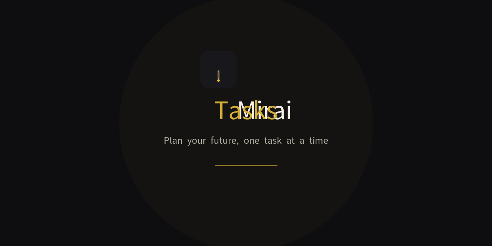

# MiraiTasks

A luxury to-do list app — plan your future, one task at a time.

## Features

- **Task management** — Create, edit, complete, and delete tasks with titles, notes, priority levels (High/Medium/Low), and due dates
- **Progress insights** — Dashboard with completion trends, priority breakdown charts, streak tracking, and real-time statistics
- **Landing page** — Public entry point with brand identity and feature highlights
- **Authentication** — Email/password sign up, sign in, sign out with session persistence and protected routes
- **Settings** — Profile editing, theme toggle (Light/Dark/System), default filter/sort preferences, data export (JSON), and danger zone (clear data, delete account)
- **Luxury design system** — Obsidian/gold dark-first theme, Playfair Display + Inter typography, design tokens, smooth micro-interactions

## Brand Assets

| File | Description |
|---|---|
| `src/assets/brand/logo.svg` | Full horizontal lockup (monogram + wordmark) |
| `src/assets/brand/logo-mark.svg` | M monogram icon only |
| `src/assets/brand/logo-mono.svg` | Single-color monochrome variant |
| `public/favicon.svg` | SVG favicon (M monogram on obsidian) |
| `public/favicon-32.png` | 32px PNG favicon |
| `public/apple-touch-icon-180.png` | 180px Apple touch icon |
| `public/icon-512.png` | 512px app icon |
| `public/social-preview.png` | 1280x640 social/OG preview image |

## Tech Stack

- React + TypeScript + Vite
- Supabase (auth + database)
- Recharts (insights charts)
- React Router (routing)

## Design

- All colors, fonts, spacing, and radii come from design tokens (`src/styles/tokens.css`). No hardcoded values in components.
- Headings use Playfair Display; body/UI uses Inter. Never swap roles.
- Logo assets live in `src/assets/brand/` — never redraw or modify the logo in code.
- Charts use Recharts, themed via design tokens; every chart has a designed empty state.
- Insights route is lazy-loaded to protect bundle size.
